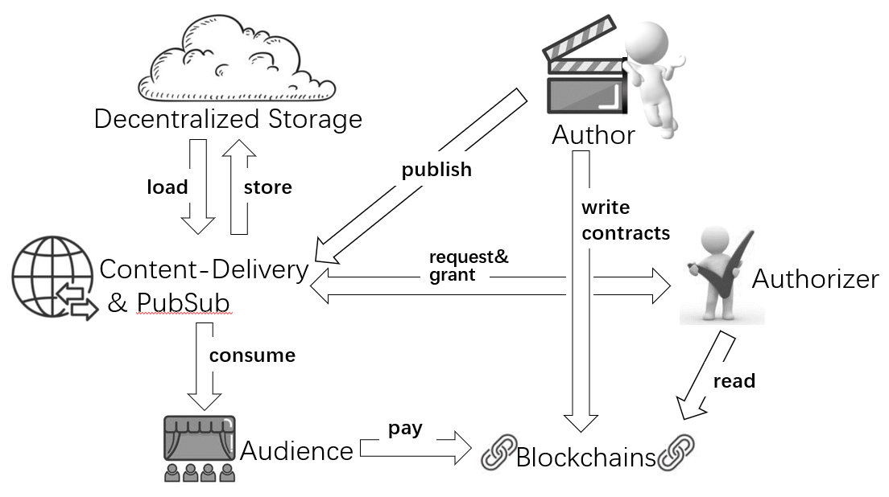

======================================
ElfinGuard Access-Control Protocol
======================================

Today users can store information with the help of Decentralized File Hosting. However, decentralizing the storage is not enough. In order to ensure full protection, users need an access-control protocol.

We aim to add this missing link by combining the power of decentralized storage with advanced access control. ElfinGuard is revolutionizing the way users protect their data. 

-------------------------------------------------------------------
ElfinGuard's Access-Control Protocol for Decentralized File Hosting
-------------------------------------------------------------------

Web 2.0 relies heavily on file hosting in tandem with content delivery networks (CDNs) to deliver multimedia contents to users.  Authors spend time and effort to create the content, and it costs them storage and bandwidth resources to deliver it to their target users.  Authors and Delivery services earn revenue from end users, either directly (fees) or indirectly (advertisement).  The Web 2.0 era has generated multiple centralized methods to directly control access to these contents; businesses can not profit if users can extract any content without permission. 

Web 3.0 has seemingly solved the problem of centralized file storage; solutions such as IPFS, Filecoin, Swarm and Arweave offer decentralized file storage.  However, this technology only incentivizes storage providers . There is no earning opportunity for authors and deliverers by using decentralized file storage solutions as there are no access-control methods.

Blockchains build an internet of value, smart contracts enable programmable value, but can the traditional internet of information be built with blockchains as well?  Can smart contracts facilitate information accessing?  ElfinGuard answers both these questions.  

ElfinGuard’s access-control protocol allows authors to program who, how and when the usesrs can access content on decentralized storages.  This technology will pave the way for new blockchain-oriented business models.   

ElfinGuard's access-control protocol has the following innovative features:

1. Hardware-based protection; making it more reliable than law, morality, discipline, or human-controlled permissions.
2. Easily programmable with solidity; authorization is based on smart contracts and on-chain states.
3. No single-point of failure; content delivery and authorization are decentralized.

This article introduces the protocol step-by-step.  Each step will refine the granularity of the solution, ultimately providing a comprehensive understanding of this innovative technology.

Enforced Permissions on Public Data
-----------------------------------

While there isn't a common definition of Web 3.0, most people believe it will empower users to control their own data, enjoy greater privacy and prevent centralized platforms from monopolizing the acquisition, recommendation, and censorship of their information. Thus, the decentralization of data storage and data delivery are key cornerstones of Web 3.0.

Today, decentralized storage is easily accessible.  The solutions, such as IPFS, have made significant strides in enabling users to store and deliver the content. For example, users can pin a video on IPFS with multiple utilities.  However, delivering the content efficiently and smoothly to all viewers still remains challenging. This is where centralized platforms provide the most value as they ensure smooth delivery to a mass audience. 

As content becomes more sophisticated, it requires larger file size to contain high-resolution pictures, articles with tables & figures, and large audio & video content, which are expensive to transfer, even more so than to store them. This is because the cost of bandwidth is higher than that of storage.  Content delivery networks (CDNs) can help reduce the bandwidth cost by caching data in edge nodes that are close to the target audience.  

In the Web 3.0 era, users still need CDNs. However, CDN providers only serve websites that pay them.  Providers use the "same origin policy" to decide whether to serve a request.  If website B contains an image or video from website A, the CDN provider will not serve B by providing A's contents. 

Decentralized storage schemes, on the other hand, do not explicitly reveal a file's origin or constrain access to files based on the “same origin policy.”  Thus, users can only encourage CDN providers to serve permissionless data to the public, i.e., ignore which website or App is requesting the data, which severely limits the use cases for authors.

This is where ElfinGuard comes in. ElfinGuard allows authors to create enforceable permissions on public content in decentralized storages and ensures only their target audience can access that content.

Encryption enclaves plays a critical role in helping authors secure their content and reach the target audience .  Encryption enclaves connect to each other and share one symmetric key for encryption/decryption.  This key is generated inside one encryption enclave and broadcasted to others through secure channels, and hardware enclaves protect the symmetric key.  An original file, together with its target audience's addresses, is encrypted into one file via an encryption enclave. The encrypted file is then stored on IPFS.

When a user requests the original file, a CDN provider fetches the encrypted data and uses an encryption enclave to decrypt it.  The enclave will then check if the requester's address is listed as the file's target audience. If so, it decrypts the file and the CDN provider sends the original file to the requester. 

End-to-end encryption
-----------------------------------

On Web 2.0 platforms users can update original files without any encryption.  As a result, these files can be vulnerable to being leaked to the public or malicious attackers, even if users request a platform to keep them private.  Most Platforms are required by law and company rule to have an active privacy disclosure, but the uploaded files must be stored in databases, which use human-controlled permissions to limit access.  Software vulnerabilities and human errors or unfaithfulness can still result in data leaks, despite a platform’s best efforts to enact privacy disclosure.

Moreover, operators on a CDN provider’s backend can view any content, regardless of the access constraint of the actual website it serves.  In our above example, the CDN provider can keep a copy of the decrypted file against the author's will.

The solution to these issues is upgrading encryption enclaves to "re-cryptors".  A re-cryptor takes an encrypted file as an input, decrypts it into the original content, and finally re-encrypts it with another distinct key.

When an author wants a re-cryptor to encrypt a file before uploading it to IPFS, he or she must encrypt the original file beforehand with a shared secret that is only known to them and the re-cryptor.  When a user requests a re-cryptor to decrypt a file from IPFS, he or she will get a file encrypted with the shared secret, not the original file.

During the whole process of storing and delivering, only the inside logic of the re-cryptor enclave can access the original content, and the usage of hardware enclaves ensures it will never be leaked.  Therefore, other than the author and the target audience, no other humans from the platform or CDN provider can view the original content. 

Authorization contracts
-----------------------------------

Traditionally, CDN providers require authorization servers to provide sophisticated dynamic access control.  Authorization servers are typically created by a CDN provider's customer.  For example, if Bob requests to view a URL of website A, the CDN provider will ask the website A’s authorization server whether Bob is authorized to view the URL.  The website A may allow Bob to view it if he is a VVIP, or make Bob wait until Friday if he is a VIP, or deny Bob if he is neither.  However, in the Web 3.0 era, authors need a more streamlined way for dynamic access control as running an authorization server is too complicated and time consuming for ordinary authors.

One solution to this problem is to use on-chain Smart Contracts for dynamic access control.  For instance, an author may choose to restrict access to their content to only holders of specific NFTs or ERC20 tokens.  A re-cryptor then uses an `eth_call` to invoke a smart contract's function with the requestor's address as the argument, if it returns "true" then the requestor is granted access.  The file uploaded to IPFS specifies which contracts to call and how to call them, rather than a static set of target audience. This approach provides authors with a more efficient and effective way to manage dynamic access control.

Multi-Grant from Authorities
-----------------------------------
When a re-cryptor requires `eth_call` for authorization, there’s a potential for ‘Witch Attacks’ to occur.  To query `eth_call,’ users need a blockchain node to provide RPC endpoints.  A node can be run by a user, but in most cases the user will rent a node from a Node-as-a-Service (NaaS) provider.

Although the re-cryptors' internal data and logic are safe under the protection of enclaves, the input data the re-cryptor receives through `eth_call` may be incorrect – this can be for various reasons.  A CDN provider may receive incorrect information from a NaaS provider due to incorrect configuration of the re-cryptor's DNS and TLS settings.  A node run by a CDN provider may also return incorrect information if it is hacked because of vulnerabilities.  Any CDN provider may have security problems; thus, trusting one single CDN provider is problematic for content authors.

To address this issue, the solution is to separate the task of authorization out from the re-cryptors and use dedicated Authorizers to query `eth_call.`  These authorizers are run by several trustworthy authorities and have strong security measures and good reputations.

To further protect the symmetric key, we use a "multi-grant" scheme which is like that of "multi-signature." The content creator specifies an “N” number of authorities and a threshold number “M” (M < N).  Before uploading, the re-cryptor must encrypt the original file with all “N” grant codes.  In tandem, before the re-cryptor decrypts a file for a requestor, the requestor must collect at least “M” grant codes from the specified authorities.

All Authorizers run by the same authority have the same "grant root".  For each individual file, an authorizer derives a unique grant code from the grant root, after it ensures the requestor is allowed access to the file. The derived grant root is generated inside enclaves and shared amongst enclaves, ensuring that even an operator employed by the authority cannot view the root value.  The grant codes are sent from authorizers to re-cryptors through secure channels which prevent any third party from viewing them.  To ensure grant codes are sent only to trustable enclaves, authorizers always check with the re-cryptors before opening secure channels.

(The encryption/decryption algorithm for "multi-grant" will be introduced in a separate article.)

5. Multi-zone to mitigate risks of enclaves' vulnerabilities
-----------------------------------
Enclaves are integral to a system's security, but it still may be compromised if the underlying hardware has vulnerabilities.  Despite there have been no real attacks reported on CPUs with hyperthreading disabled, the risk of security breaches still exists.

Currently, enclaves can be implemented using Intel's SGX & TDX, AMD's SEV-SNP, ARM's TEE, and AWS's Nitro.  SGX is the most mature and mainstream solution while the others are rapidly evolving.  Enclaves are divided into different zones, and each zone uses the same technology.  For example, all enclaves based on Intel SGX are in the same zone.

The probability of all zones being simultaneously exploited by hackers is extremely low.  However, an author can further protect his or her file by splitting it into multiple parts, each of which is protected by a different enclave zone.

For example, an author divides a file into three parts: Part #1 is protected by SGX enclaves, Part #2 by SEV-SNP enclaves, and Part #3 by AWS's Nitro enclaves.  This approach requires the audience to retrieve all three parts to recover the full original file.

The Big Picture
-------------------
ElfinGuard Access-Control Protocol uses smart contracts to manage file accessibility with following functions:

The author uses smart contracts to program file accessibility and uploads these files to re-cryptors run by CDN providers.  The re-cryptors encrypt files and store them in decentralized storage services.

When the audience wants to view a file, they must connect to a re-cryptor that can retrieve the file out from the decentralized storages.  The re-cryptor will request the authorizer to grant file decryption.  When the re-cryptor decrypts the file, the audience can download it.

The content author writes smart contracts to specify what audience behaviors or states on blockchains will be qualified to view the file.  In most cases the ‘behavior’ is a payment (audience pays the author directly with ERC20 tokens) and the ‘state’ is ownership of certain NFTs.

To close the circle, an authorizor uses the blockchain's RPC nodes to determine whether to grant the decryption based on specified behaviors or states.  Once these processes are completed and verified, the author’s intended audience can view the content.
